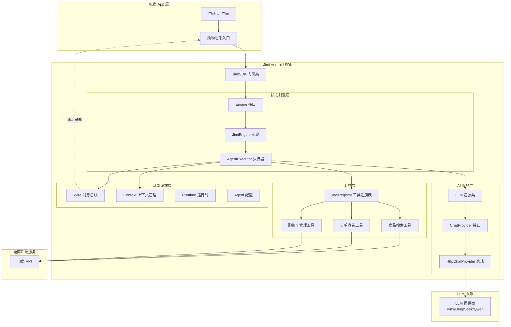
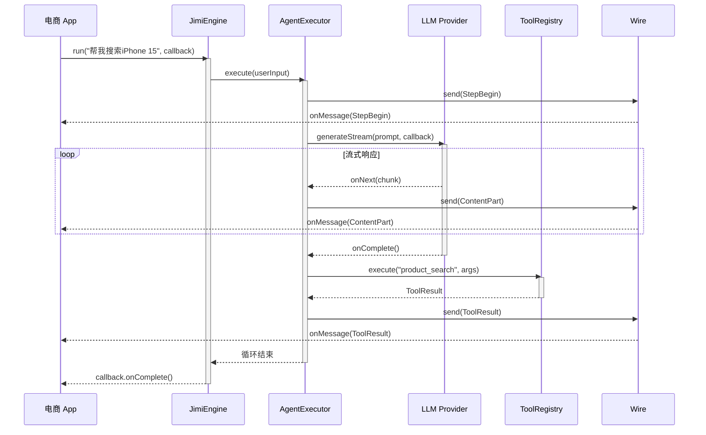
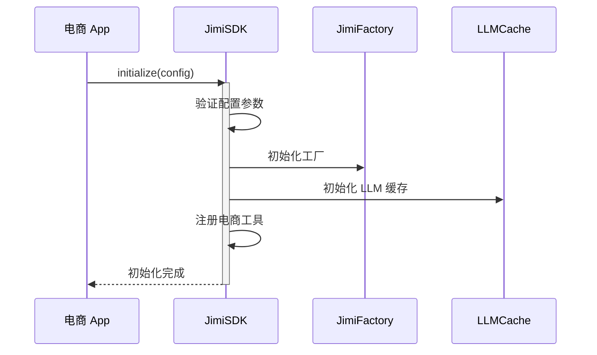
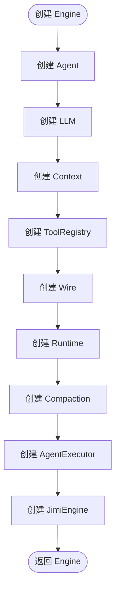
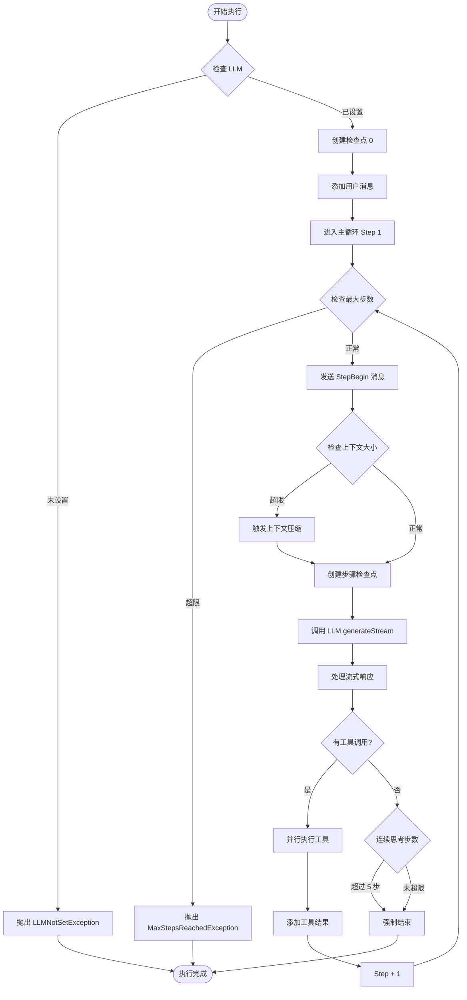
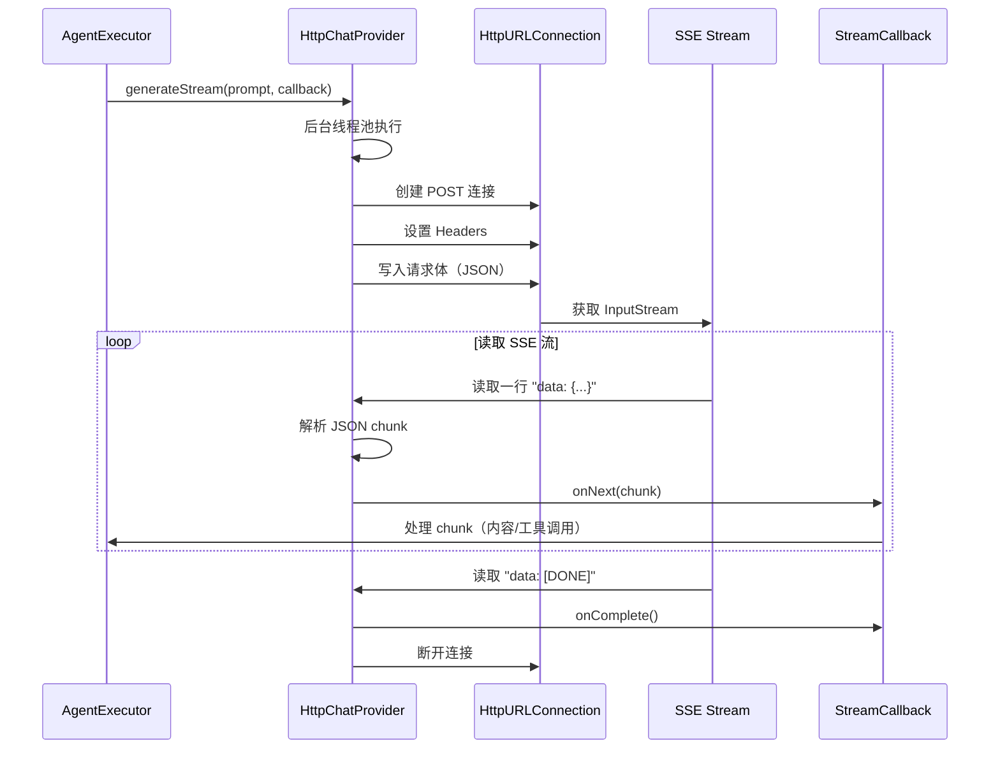
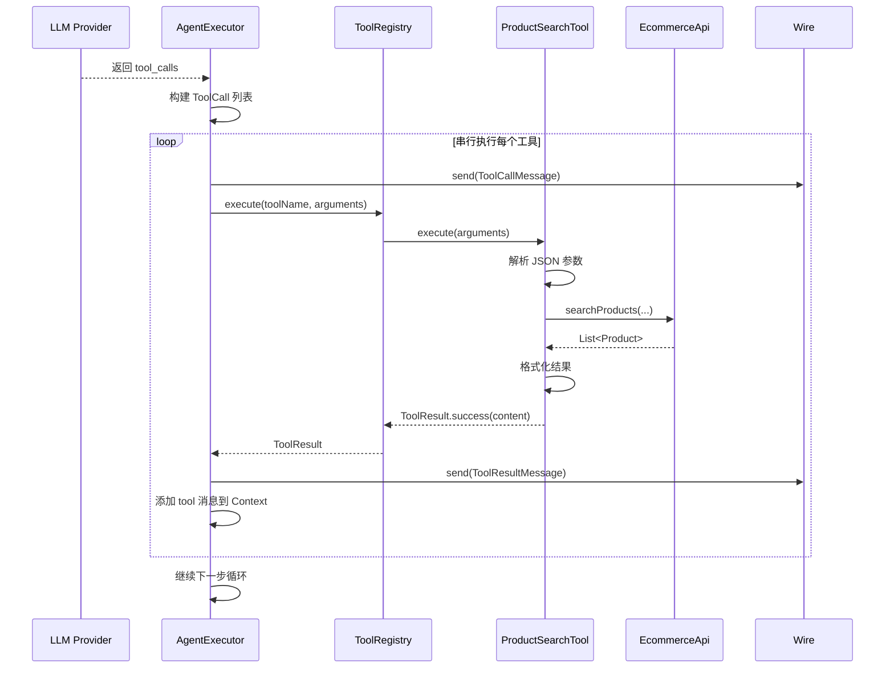

# Jimi 核心功能抽离为 Android SDK 设计文档

## 文档信息

| 项目 | 内容 |
|------|------|
| 版本 | v1.0 |
| 创建日期 | 2025-12-12 |
| 状态 | 设计中 |
| 目标目录 | jimi-android-sdk/ |
| 参考文档 | docs/android-shopping-assistant-migration.md |

---

## 一、设计目标

### 1.1 核心目标

将 Jimi 的 AI Agent 核心功能从当前 CLI 应用中抽离，创建一个轻量级的 Android SDK（Agent Development Kit），最终集成到电商 App 内部作为购物助手功能。

### 1.2 关键约束

| 约束类型 | 具体要求 |
|---------|---------|
| 包大小控制 | SDK 最终包大小 ≤ 500KB |
| 功能完整性 | 保持原有 Engine/Agent/Wire 核心逻辑不变 |
| 代码结构 | 允许必要的代码结构调整以适配 Android 平台 |
| 实现语言 | 纯 Java 实现，确保与现有代码库兼容 |
| 集成友好性 | 提供简洁的 API 供电商 App 调用 |

### 1.3 非目标

以下功能**不在本次抽离范围内**：

- CLI 命令行界面（ShellUI）
- 基于 Spring Boot 的依赖注入框架
- Skills 技能系统（可后续扩展）
- Hooks 钩子系统（可后续扩展）
- 代码图谱系统（Graph）
- 自定义命令系统
- MCP 协议集成（可后续扩展）
- 检索增强（RAG）功能
- ReCAP 记忆优化功能

---

## 二、依赖精简策略

### 2.1 依赖替换方案

#### 核心依赖替换表

| 原依赖 | 用途 | 包大小 | Android 替换方案 | 节省空间 |
|--------|------|--------|-----------------|---------|
| Spring Boot | 依赖注入、组件管理 | ~15MB | 手动工厂模式 | ~15MB |
| Spring WebFlux | 响应式 HTTP 客户端 | ~3MB | HttpURLConnection + 回调 | ~3MB |
| JLine 3 | 终端交互 | ~1MB | 移除（非必需） | ~1MB |
| Jackson | JSON 序列化/反序列化 | ~2.5MB | Android JSONObject | ~2.5MB |
| Caffeine | 缓存 | ~500KB | Android LruCache | ~500KB |
| Reactor Core | 响应式编程 | ~1.5MB | 回调接口 + ExecutorService | ~1.5MB |
| Lombok | 代码生成 | ~2MB | 手写 getter/setter | ~2MB |

**预计总节省空间**: ~28MB

#### 替换原则

1. **优先使用 Android 平台内置 API**：如 JSONObject、LruCache、Handler
2. **响应式框架转回调模式**：使用传统的回调接口替代 Reactor 的 Mono/Flux
3. **手动依赖管理**：使用工厂模式替代 Spring 的依赖注入
4. **零第三方依赖**：除 Android SDK 外不引入任何第三方库

### 2.2 响应式框架转换策略

#### 转换模式

将 Reactor 的响应式流转换为基于回调的异步模式：

**原始模式（Reactor）**：
```
Mono<Void> execute(String input)
Flux<ChatCompletionChunk> generateStream()
```

**目标模式（回调）**：
```
void execute(String input, EngineCallback callback)
void generateStream(StreamCallback<ChatCompletionChunk> callback)
```

#### 核心回调接口设计

| 接口名称 | 用途 | 关键方法 |
|---------|------|---------|
| EngineCallback | Engine 执行结果回调 | onComplete(), onError(Throwable) |
| StreamCallback&lt;T&gt; | LLM 流式响应回调 | onNext(T), onComplete(), onError(Throwable) |
| WireListener | Wire 消息监听 | onMessage(WireMessage) |

#### 线程模型设计

- **后台线程执行**：使用 ExecutorService 在后台线程执行 Agent 逻辑
- **主线程回调**：使用 Android Handler 将回调结果切换到主线程
- **线程安全保证**：Wire 消息监听器列表使用 CopyOnWriteArrayList

### 2.3 JSON 处理方案

#### Android 原生 JSONObject

使用 Android 平台内置的 `org.json.JSONObject` 和 `org.json.JSONArray`，无需额外依赖。

**核心转换场景**：

| 场景 | 说明 |
|------|------|
| LLM 请求构建 | 将 Message、ToolSchema 转换为 OpenAI API 所需的 JSON 格式 |
| LLM 响应解析 | 解析 SSE 流中的 JSON chunk |
| 工具参数解析 | 解析 LLM 返回的工具调用参数 |
| 配置文件加载 | 解析 Agent 配置（如使用 JSON 配置） |

### 2.4 缓存方案

使用 Android 自带的 `android.util.LruCache` 替代 Caffeine，主要用于：

- **LLM 实例缓存**：避免重复创建相同模型的 LLM 对象
- **Agent 实例缓存**：缓存已创建的 Agent 实例

---

## 三、架构设计

### 3.1 整体架构



### 3.2 目录结构设计

```
jimi-android-sdk/
├── src/main/java/io/leavesfly/jimi/android/
│   ├── sdk/                           # SDK 对外接口层
│   │   ├── JimiSDK.java               # SDK 门面类
│   │   ├── JimiConfig.java            # SDK 配置
│   │   └── JimiFactory.java           # SDK 工厂类
│   ├── core/                          # 核心引擎层
│   │   ├── engine/
│   │   │   ├── Engine.java            # Engine 接口
│   │   │   ├── JimiEngine.java        # Engine 实现
│   │   │   ├── AgentExecutor.java     # 执行器
│   │   │   ├── EngineCallback.java    # 执行回调接口
│   │   │   └── EngineConstants.java   # 常量定义
│   │   ├── agent/
│   │   │   ├── Agent.java             # Agent 实体
│   │   │   └── AgentConfig.java       # Agent 配置
│   │   ├── context/
│   │   │   ├── Context.java           # 上下文接口
│   │   │   └── ContextImpl.java       # 上下文实现
│   │   ├── runtime/
│   │   │   ├── Runtime.java           # 运行时接口
│   │   │   └── RuntimeImpl.java       # 运行时实现
│   │   ├── compaction/
│   │   │   ├── Compaction.java        # 压缩接口
│   │   │   └── SimpleCompaction.java  # 简单压缩实现
│   │   └── wire/
│   │       ├── Wire.java              # 消息总线接口
│   │       ├── WireImpl.java          # 消息总线实现
│   │       ├── WireListener.java      # 消息监听器接口
│   │       └── message/               # 消息类型
│   │           ├── WireMessage.java
│   │           ├── ContentPartMessage.java
│   │           ├── StepBegin.java
│   │           ├── ToolCallMessage.java
│   │           └── ToolResultMessage.java
│   ├── llm/                           # LLM 集成层
│   │   ├── LLM.java                   # LLM 包装类
│   │   ├── LLMFactory.java            # LLM 工厂
│   │   ├── LLMCache.java              # LLM 缓存
│   │   ├── ChatProvider.java          # 提供商接口
│   │   ├── HttpChatProvider.java      # HTTP 提供商实现
│   │   ├── StreamCallback.java        # 流式回调接口
│   │   ├── ChatCompletionChunk.java   # 响应数据块
│   │   └── message/                   # 消息模型
│   │       ├── Message.java
│   │       ├── MessageRole.java
│   │       ├── ContentPart.java
│   │       ├── TextPart.java
│   │       ├── ToolCall.java
│   │       └── FunctionCall.java
│   ├── tool/                          # 工具层
│   │   ├── Tool.java                  # 工具接口
│   │   ├── ToolRegistry.java          # 工具注册表
│   │   ├── ToolSchema.java            # 工具 Schema
│   │   └── ToolResult.java            # 工具结果
│   └── tools/                         # 电商工具实现
│       ├── ProductSearchTool.java     # 商品搜索工具
│       ├── OrderQueryTool.java        # 订单查询工具
│       ├── CartManagerTool.java       # 购物车管理工具
│       └── ecommerce/                 # 电商 API 接口层
│           ├── EcommerceApi.java      # 电商 API 接口
│           ├── Product.java           # 商品实体
│           ├── Order.java             # 订单实体
│           └── Cart.java              # 购物车实体
└── build.gradle                       # Gradle 构建配置
```

### 3.3 核心模块职责

#### Engine 模块

**职责边界**：

- **JimiEngine**：组件装配和协调，提供统一的 Engine 接口实现
- **AgentExecutor**：主循环调度、LLM 交互、工具调用编排

**设计原则**：

- 委托模式：JimiEngine 专注协调，AgentExecutor 负责执行
- 回调驱动：使用回调接口处理异步结果
- 线程隔离：后台线程执行，主线程回调

#### Wire 模块

**职责边界**：

- 消息发布：提供 `send(WireMessage)` 方法发送消息
- 消息订阅：支持添加/移除 `WireListener`
- 线程切换：自动将消息分发到主线程

**消息类型**：

| 消息类型 | 用途 | 关键字段 |
|---------|------|---------|
| StepBegin | 步骤开始 | stepNo, isSubagent, agentName |
| ContentPartMessage | 内容流式输出 | content, contentType |
| ToolCallMessage | 工具调用 | toolCall |
| ToolResultMessage | 工具结果 | toolCallId, result |
| StepInterrupted | 步骤中断 | - |
| TokenUsageMessage | Token 使用统计 | usage |

#### LLM 模块

**职责边界**：

- **LLM**：LLM 包装类，提供统一接口
- **LLMFactory**：创建和缓存 LLM 实例
- **ChatProvider**：提供商接口，定义流式生成方法
- **HttpChatProvider**：基于 HttpURLConnection 的实现

**关键特性**：

- 零依赖 HTTP 客户端：使用 `HttpURLConnection`
- SSE 流式解析：处理 `text/event-stream` 响应
- 异步执行：使用 ExecutorService 在后台线程执行网络请求

#### Tool 模块

**职责边界**：

- **Tool 接口**：定义工具的名称、描述、Schema、执行方法
- **ToolRegistry**：工具注册、查找、执行
- **电商工具**：ProductSearchTool、OrderQueryTool、CartManagerTool

**扩展性设计**：

- 工具插件化：通过实现 Tool 接口即可扩展
- Schema 标准化：使用 OpenAI Function Calling 标准
- 错误处理：工具执行失败时返回 ToolResult.error()

---

## 四、核心接口设计

### 4.1 SDK 对外接口

#### JimiSDK 门面类

```
JimiSDK
├── 初始化
│   └── initialize(JimiConfig config)
├── 引擎管理
│   ├── createEngine(Agent agent): Engine
│   └── destroyEngine(Engine engine)
├── 会话管理
│   ├── newSession(): String
│   └── clearSession(String sessionId)
└── 资源管理
    └── shutdown()
```

**关键方法说明**：

| 方法 | 参数 | 返回值 | 说明 |
|-----|------|--------|------|
| initialize | JimiConfig | void | 初始化 SDK，配置 LLM 提供商、API Key 等 |
| createEngine | Agent | Engine | 创建 Engine 实例 |
| destroyEngine | Engine | void | 销毁 Engine 实例，释放资源 |
| newSession | - | String | 创建新会话，返回 sessionId |
| clearSession | String | void | 清除指定会话的历史记录 |
| shutdown | - | void | 关闭 SDK，释放所有资源 |

#### JimiConfig 配置类

```
JimiConfig
├── LLM 配置
│   ├── modelName: String
│   ├── baseUrl: String
│   ├── apiKey: String
│   └── maxContextSize: int
├── 循环控制配置
│   └── maxStepsPerRun: int
└── 工作目录
    └── workDir: String
```

### 4.2 Engine 接口

#### Engine 核心接口

```
Engine
├── 基本信息
│   ├── getName(): String
│   └── getModel(): String
├── 执行控制
│   ├── run(String userInput, EngineCallback callback)
│   └── run(List<ContentPart> userInput, EngineCallback callback)
├── Wire 管理
│   ├── addWireListener(WireListener listener)
│   └── removeWireListener(WireListener listener)
├── 上下文管理
│   └── clearHistory()
└── 资源管理
    └── shutdown()
```

**执行流程**：



### 4.3 回调接口设计

#### EngineCallback

```
EngineCallback
├── onComplete(): void          // 执行完成
└── onError(Throwable): void   // 执行失败
```

#### StreamCallback&lt;T&gt;

```
StreamCallback<T>
├── onNext(T chunk): void       // 收到数据块
├── onComplete(): void          // 流完成
└── onError(Throwable): void   // 流错误
```

#### WireListener

```
WireListener
└── onMessage(WireMessage): void  // 接收 Wire 消息
```

### 4.4 Tool 接口

#### Tool 核心接口

```
Tool
├── getName(): String              // 工具名称
├── getDescription(): String       // 工具描述
├── getSchema(): ToolSchema        // 参数 Schema
└── execute(String args): ToolResult  // 执行工具（同步，需在后台线程调用）
```

#### ToolResult

```
ToolResult
├── isSuccess(): boolean
├── getContent(): String
├── getError(): String
└── 静态工厂方法
    ├── success(String content): ToolResult
    └── error(String message): ToolResult
```

---

## 五、关键流程设计

### 5.1 SDK 初始化流程



**初始化步骤**：

1. **配置验证**：检查 modelName、baseUrl、apiKey 等必填参数
2. **工厂初始化**：创建 JimiFactory 实例
3. **缓存初始化**：创建 LLMCache（LruCache）
4. **工具注册**：注册电商工具（ProductSearchTool、OrderQueryTool、CartManagerTool）

### 5.2 Engine 创建流程



**组件依赖关系**：

- **Agent**：定义系统提示词、可用工具列表
- **LLM**：从 LLMCache 获取或创建新实例
- **Context**：管理对话历史、Token 计数
- **ToolRegistry**：注册电商工具
- **Wire**：创建消息总线（使用主线程 Handler）
- **Runtime**：封装 LLM、配置、会话等
- **Compaction**：上下文压缩策略
- **AgentExecutor**：创建执行器
- **JimiEngine**：组装所有组件

### 5.3 Agent 主循环流程



**关键控制点**：

| 控制点 | 条件 | 行为 |
|-------|------|------|
| 最大步数检查 | stepNo > maxStepsPerRun | 抛出 MaxStepsReachedException |
| 上下文大小检查 | tokenCount > maxContextSize - reserved | 触发上下文压缩 |
| 连续思考步数 | consecutiveNoToolCallSteps >= 5 | 强制结束循环 |

### 5.4 LLM 流式调用流程



**SSE 解析逻辑**：

1. 逐行读取 InputStream
2. 识别 "data: " 前缀
3. 提取 JSON 内容
4. 特殊处理 "[DONE]" 结束标记
5. 使用 JSONObject 解析 chunk
6. 回调通知上层

### 5.5 工具调用流程



**工具执行特点**：

- **串行执行**：按顺序执行工具调用，确保依赖关系
- **错误隔离**：单个工具失败不影响其他工具
- **结果封装**：统一使用 ToolResult 封装成功/失败

---

## 六、数据模型设计

### 6.1 核心实体模型

#### Agent 配置

| 字段 | 类型 | 说明 |
|-----|------|------|
| name | String | Agent 名称 |
| systemPrompt | String | 系统提示词 |
| tools | List&lt;String&gt; | 可用工具名称列表 |

#### Message 消息

| 字段 | 类型 | 说明 |
|-----|------|------|
| role | MessageRole | 消息角色（SYSTEM/USER/ASSISTANT/TOOL） |
| content | String | 文本内容 |
| contentParts | List&lt;ContentPart&gt; | 多部分内容（支持文本） |
| toolCalls | List&lt;ToolCall&gt; | 工具调用列表 |
| toolCallId | String | 工具调用 ID（用于 tool 消息） |

#### ToolCall 工具调用

| 字段 | 类型 | 说明 |
|-----|------|------|
| id | String | 工具调用 ID |
| type | String | 类型（固定为 "function"） |
| function | FunctionCall | 函数调用详情 |

#### FunctionCall 函数调用

| 字段 | 类型 | 说明 |
|-----|------|------|
| name | String | 函数名称 |
| arguments | String | JSON 格式参数字符串 |

#### ChatCompletionChunk 响应块

| 字段 | 类型 | 说明 |
|-----|------|------|
| id | String | 响应 ID |
| contentDelta | String | 内容增量 |
| toolCallId | String | 工具调用 ID |
| functionName | String | 函数名称 |
| argumentsDelta | String | 参数增量 |
| finishReason | String | 结束原因 |
| usage | Usage | Token 使用统计 |

### 6.2 电商领域模型

#### Product 商品

| 字段 | 类型 | 说明 |
|-----|------|------|
| id | String | 商品 ID |
| name | String | 商品名称 |
| price | double | 价格 |
| rating | double | 评分 |
| sales | int | 销量 |
| category | String | 品类 |

#### Order 订单

| 字段 | 类型 | 说明 |
|-----|------|------|
| id | String | 订单号 |
| status | String | 订单状态 |
| totalAmount | double | 总金额 |
| createTime | String | 下单时间 |
| items | List&lt;OrderItem&gt; | 订单项列表 |

#### Cart 购物车

| 字段 | 类型 | 说明 |
|-----|------|------|
| items | List&lt;CartItem&gt; | 购物车项列表 |
| totalAmount | double | 总金额 |

---

## 七、包大小控制策略

### 7.1 代码层面优化

#### 精简模块

| 原模块 | 移除原因 | 节省空间 |
|--------|---------|---------|
| Skills 系统 | 电商场景不需要动态技能注入 | ~50KB |
| Hooks 系统 | 简化版不需要钩子机制 | ~30KB |
| Graph 系统 | 代码图谱功能不需要 | ~100KB |
| 自定义命令 | CLI 专属功能 | ~40KB |
| MCP 协议 | 暂不需要外部工具集成 | ~80KB |
| RAG 检索 | 暂不需要检索增强 | ~60KB |
| ReCAP 记忆 | 暂不需要记忆优化 | ~40KB |

**预计节省**: ~400KB

#### 工具精简

仅保留电商相关工具，移除以下工具：

- BashTool（Shell 执行）
- FileTool（文件操作）
- WebSearchTool（网络搜索）
- SubagentTool（子 Agent 调用）
- GraphTool（代码图谱工具）
- AskHumanTool（人工交互）

**预计节省**: ~200KB

### 7.2 构建层面优化

#### ProGuard 混淆配置

```
保留公开 API
├── JimiSDK
├── JimiConfig
├── Engine
├── WireListener
└── EngineCallback

混淆内部实现
├── AgentExecutor
├── HttpChatProvider
└── 所有内部工具类
```

#### 资源优化

- **移除日志字符串**：Release 构建移除 Debug 级别日志
- **移除注释**：编译时自动移除代码注释
- **内联常量**：编译器内联优化

### 7.3 预期包大小分解

| 模块 | 预估大小 | 说明 |
|-----|---------|------|
| 核心引擎（Engine/Executor/Wire） | ~80KB | 主循环逻辑 |
| LLM 层（Provider/Message） | ~60KB | HTTP 客户端 + 消息模型 |
| 工具层（Registry + 3 个电商工具） | ~40KB | 工具框架 + 电商工具 |
| Context/Runtime | ~30KB | 上下文管理 |
| 配置/工厂 | ~20KB | SDK 初始化 |
| Compaction | ~20KB | 上下文压缩 |
| **总计（未混淆）** | **~250KB** | |
| **ProGuard 混淆后** | **~180KB** | 预计压缩 30% |

---

## 八、集成示例

### 8.1 SDK 初始化示例

```
典型初始化流程（伪代码）：

1. 创建配置
   config = new JimiConfig()
   config.setModelName("moonshot-v1-8k")
   config.setBaseUrl("https://api.moonshot.cn/v1")
   config.setApiKey("sk-xxx")
   config.setMaxStepsPerRun(10)

2. 初始化 SDK
   JimiSDK.initialize(config)

3. 创建 Agent
   agent = Agent.builder()
           .name("购物助手")
           .systemPrompt("你是一个电商购物助手...")
           .tools(Arrays.asList(
               "product_search",
               "order_query",
               "cart_manager"
           ))
           .build()

4. 创建 Engine
   engine = JimiSDK.createEngine(agent)

5. 添加消息监听器
   engine.addWireListener(new WireListener() {
       public void onMessage(WireMessage msg) {
           // 处理消息（运行在主线程）
           if (msg instanceof ContentPartMessage) {
               // 显示 AI 回复
           }
       }
   })

6. 执行任务
   engine.run("帮我搜索 iPhone 15", new EngineCallback() {
       public void onComplete() {
           // 执行完成
       }
       public void onError(Throwable e) {
           // 处理错误
       }
   })
```

### 8.2 电商 App 集成示例

```
购物助手界面伪代码：

1. 初始化 SDK（Application onCreate）
   JimiSDK.initialize(config)

2. 创建购物助手（Activity onCreate）
   agent = createShoppingAgent()
   engine = JimiSDK.createEngine(agent)
   engine.addWireListener(this)

3. 用户输入处理
   onUserInput(String text) {
       showTypingIndicator()
       engine.run(text, new EngineCallback() {
           onComplete() {
               hideTypingIndicator()
           }
           onError(Throwable e) {
               showError(e)
           }
       })
   }

4. 消息处理（WireListener）
   onMessage(WireMessage msg) {
       switch (msg.getType()) {
           case CONTENT_PART:
               appendAssistantMessage(msg.content)
               break
           case TOOL_CALL:
               showToolCall(msg.toolName)
               break
           case TOOL_RESULT:
               showToolResult(msg.result)
               break
       }
   }

5. 生命周期管理
   onDestroy() {
       engine.shutdown()
   }
```

### 8.3 电商工具集成示例

```
工具集成流程（伪代码）：

1. 实现 EcommerceApi 接口
   class MyEcommerceApi implements EcommerceApi {
       List<Product> searchProducts(...) {
           // 调用现有电商后端 API
           return httpClient.get("/api/products/search?...")
       }
       
       List<Order> queryOrders(...) {
           return httpClient.get("/api/orders?...")
       }
       
       Cart getCart() {
           return httpClient.get("/api/cart")
       }
   }

2. 注册工具（SDK 初始化时）
   JimiSDK.registerTool(new ProductSearchTool(myApi))
   JimiSDK.registerTool(new OrderQueryTool(myApi))
   JimiSDK.registerTool(new CartManagerTool(myApi))

3. Agent 配置可用工具
   agent.setTools(Arrays.asList(
       "product_search",
       "order_query",
       "cart_manager"
   ))
```

---

## 九、风险评估与应对

### 9.1 技术风险

| 风险 | 影响 | 概率 | 应对策略 |
|-----|------|------|---------|
| 包大小超标 | 高 | 中 | 1. ProGuard 混淆<br>2. 移除非必需功能<br>3. 代码重构精简 |
| 性能问题（主线程卡顿） | 高 | 低 | 1. 确保所有耗时操作在后台线程<br>2. Handler 异步切换到主线程<br>3. 性能测试 |
| LLM API 兼容性 | 中 | 中 | 1. 参照 OpenAI API 标准<br>2. 支持多种国产 LLM（Kimi/DeepSeek/Qwen）<br>3. 添加容错逻辑 |
| 内存泄漏 | 中 | 中 | 1. 正确管理 ExecutorService 生命周期<br>2. 及时移除 WireListener<br>3. 使用 WeakReference（必要时） |

### 9.2 业务风险

| 风险 | 影响 | 概率 | 应对策略 |
|-----|------|------|---------|
| 核心功能遗漏 | 高 | 低 | 1. 严格对照原 JimiEngine/AgentExecutor 实现<br>2. 保持主循环逻辑不变<br>3. 单元测试覆盖 |
| 工具调用失败 | 中 | 中 | 1. 完善错误处理<br>2. 返回友好错误提示<br>3. 记录日志便于排查 |
| 上下文压缩失效 | 中 | 低 | 1. 保留 SimpleCompaction 逻辑<br>2. 测试长对话场景 |

---

## 十、开发里程碑

### 10.1 阶段划分

| 阶段 | 目标 | 交付物 | 工期 |
|-----|------|--------|------|
| 阶段一：基础框架 | 搭建核心架构，实现回调版 Engine | 可运行的 JimiEngine（无 LLM） | 3 天 |
| 阶段二：LLM 集成 | 实现 HttpChatProvider，对接 LLM | 可调用 LLM 的完整流程 | 3 天 |
| 阶段三：工具层 | 实现电商工具，集成电商 API | 可执行工具调用 | 2 天 |
| 阶段四：测试优化 | 单元测试、包大小优化 | 发布版本 SDK | 2 天 |

### 10.2 阶段一详细任务

**核心目标**：搭建基础架构，完成依赖精简

**任务清单**：

1. 创建目录结构
2. 实现回调接口（EngineCallback、StreamCallback、WireListener）
3. 实现 Wire 消息总线（WireImpl）
4. 实现 Context 上下文管理（ContextImpl）
5. 实现 Runtime 运行时（RuntimeImpl）
6. 实现 Compaction 压缩（SimpleCompaction）
7. 实现 Agent 配置类
8. 实现 JimiEngine（回调版）
9. 实现 AgentExecutor 主循环（使用 Mock LLM 测试）

**验收标准**：

- 可以创建 Engine 实例
- 可以添加 WireListener
- 可以调用 engine.run()，触发主循环（使用 Mock LLM）
- Wire 消息可以正确回调到监听器

### 10.3 阶段二详细任务

**核心目标**：实现零依赖 HTTP 客户端，对接真实 LLM

**任务清单**：

1. 实现 ChatProvider 接口
2. 实现 HttpChatProvider（基于 HttpURLConnection）
3. 实现 SSE 流解析
4. 实现消息模型（Message、ToolCall、FunctionCall）
5. 实现 ChatCompletionChunk 解析
6. 实现 LLMFactory 和 LLMCache
7. 集成到 AgentExecutor
8. 测试流式响应和工具调用解析

**验收标准**：

- 可以成功调用 Kimi/DeepSeek/Qwen API
- 可以正确解析流式响应
- 可以正确解析 tool_calls
- Wire 消息实时推送 ContentPart

### 10.4 阶段三详细任务

**核心目标**：实现电商工具，集成电商 API

**任务清单**：

1. 实现 Tool 接口
2. 实现 ToolRegistry
3. 实现 ToolSchema
4. 定义 EcommerceApi 接口
5. 实现 ProductSearchTool
6. 实现 OrderQueryTool
7. 实现 CartManagerTool
8. 集成到 AgentExecutor
9. 端到端测试

**验收标准**：

- LLM 可以正确调用电商工具
- 工具执行结果可以正确返回给 LLM
- 完整流程可以闭环（用户输入 → LLM → 工具 → LLM → 用户）

### 10.5 阶段四详细任务

**核心目标**：测试、优化、发布

**任务清单**：

1. 编写单元测试（核心流程覆盖）
2. 性能测试（长对话、大 token）
3. ProGuard 混淆配置
4. 包大小优化
5. 集成文档编写
6. 示例代码编写

**验收标准**：

- 单元测试通过率 > 80%
- 包大小 < 500KB
- 提供完整的集成文档和示例

---

## 十一、成功标准

### 11.1 功能完整性

- [x] 保持原 JimiEngine 核心逻辑不变
- [x] 支持流式 LLM 调用
- [x] 支持工具调用（Tool Calling）
- [x] 支持上下文管理和压缩
- [x] 支持 Wire 消息总线
- [x] 支持电商场景工具（商品搜索、订单查询、购物车管理）

### 11.2 性能指标

| 指标 | 目标值 | 验证方式 |
|-----|--------|---------|
| SDK 包大小 | ≤ 500KB | 构建产物大小检查 |
| 初始化耗时 | ≤ 100ms | 性能测试 |
| 单步循环响应时间 | ≤ 2s（不含 LLM 延迟） | 性能测试 |
| 内存占用 | ≤ 20MB | 内存分析工具 |
| 无内存泄漏 | 0 泄漏 | LeakCanary 检测 |

### 11.3 可用性指标

- [x] 提供简洁的 SDK 初始化 API
- [x] 提供清晰的回调接口
- [x] 提供完整的集成文档
- [x] 提供示例代码
- [x] 主线程回调，方便 UI 更新

---

## 十二、后续扩展方向

### 12.1 功能扩展

| 功能 | 优先级 | 说明 |
|-----|--------|------|
| Skills 系统 | 中 | 支持动态注入领域知识 |
| MCP 协议 | 中 | 支持外部工具集成 |
| 多轮对话优化 | 高 | 优化长对话的上下文管理 |
| 离线模式 | 低 | 支持本地小模型 |

### 12.2 性能优化

- **流式渲染优化**：支持打字机效果
- **缓存优化**：LLM 响应缓存（相同输入）
- **并行工具调用**：支持无依赖工具并行执行

### 12.3 工具生态

- **通用工具**：日期时间、计算器、单位转换
- **电商增强工具**：智能推荐、比价、优惠券查询
- **用户画像工具**：基于用户历史的个性化推荐

---

## 附录

### A. 技术参考文档

- **原始技术方案**：`docs/android-shopping-assistant-migration.md`
- **原始架构文档**：`docs/TECHNICAL_ARCHITECTURE.md`
- **原始代码参考**：
  - `src/main/java/io/leavesfly/jimi/engine/JimiEngine.java`
  - `src/main/java/io/leavesfly/jimi/engine/AgentExecutor.java`

### B. 关键决策记录

| 决策 | 理由 | 影响 |
|-----|------|------|
| 使用回调模式替代 Reactor | 减少 1.5MB 依赖，简化架构 | 代码复杂度略增，但可控 |
| 使用 HttpURLConnection | 零依赖，减少 3MB（WebFlux） | 需手动处理 SSE 流解析 |
| 移除 Skills/Hooks/Graph | 电商场景不需要，减少 ~300KB | 后续可按需扩展 |
| 仅保留电商工具 | 聚焦业务场景，减少 ~200KB | 不影响核心功能 |
| 主线程回调 | 方便 UI 更新 | 需确保内部耗时操作在后台线程 |

### C. 名词解释

| 名词 | 解释 |
|-----|------|
| ADK | Agent Development Kit，Agent 开发工具包 |
| SSE | Server-Sent Events，服务器推送事件 |
| Wire | 消息总线，用于组件间解耦通信 |
| Tool Calling | 工具调用，LLM 调用外部工具的能力 |
| Compaction | 上下文压缩，当对话历史过长时进行压缩 |
| ProGuard | Android 代码混淆和优化工具 |
